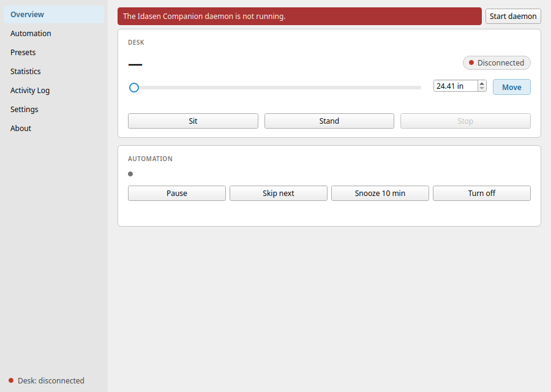

# Idasen Companion

Automatic sit/stand companion for the IKEA Idåsen desk on Linux.



Idasen Companion moves your desk between sitting and standing. It counts only
the time you spend active at the computer. It does not count the time you are
idle, or the time the session is locked.

A background daemon holds the Bluetooth connection and runs the automation. A
Qt 6 app gives you a tray icon, live status, manual control, presets,
schedules, statistics and desktop notifications.

> This is an independent, unofficial project. It is not affiliated with,
> endorsed by, or sponsored by Inter IKEA Systems B.V. IKEA and Idåsen are
> trademarks of their respective owners.

## Features

- **Active-time automation.** Two idle limits control the cycle. A lenient
  limit decides what counts as active time. A strict limit stops a move when
  you are not at the keyboard. A locked session counts as idle. The daemon
  detects suspend and resume, and never moves the desk as the machine wakes.
- **Cycle variation.** The app adds a random number of whole minutes to each
  period, so the moves do not feel mechanical.
- **Interruption handling.** After each move the daemon compares the height
  against the target. If you grabbed the paddle during the move, the desk
  returns to where it started.
- **On-demand Bluetooth.** The daemon connects only when it has work, and
  releases the desk afterwards. Other programs can then reach it. A persistent
  mode is available in the settings.
- **Manual control.** Buttons for sit, stand and stop, a height slider, and
  named presets. On the first start the app imports your saved positions from
  the `idasen` CLI.
- **Schedules.** Set the days and the hours when the automation is active.
- **Notifications.** A warning before each move, with Snooze and Skip.
- **Statistics.** Sit and stand time for each day, with a transition history.

## Requirements

Linux with systemd, a session D-Bus and BlueZ. The app runs on GNOME and KDE
Plasma, on X11 and Wayland.

CAUTION: On wlroots compositors (sway, Hyprland, river) the app cannot read
your idle time. It moves the desk on schedule even when you are away. The
Overview tab reports the idle backend as `none`.

## Install

Download the artifact for your system from the [releases page][releases].
Updates are manual: download the new release, then install it again.

**Fedora, and other distributions that use RPM**

```
sudo dnf install ./idasen-companion-*.noarch.rpm
```

This package bundles `bleak` and `idasen`, the two Python libraries Fedora
does not ship. Everything else comes from the Fedora repositories.

**Debian 13 (trixie) or newer, and Ubuntu 25.10 (questing) or newer**

```
sudo apt install ./idasen-companion_*_all.deb
```

Use `apt` and not `dpkg -i`, because `apt` installs the dependencies. This
package contains no bundled libraries. Older releases have no PySide6
packages, so this package cannot install there. Use the Flatpak instead.

**Any distribution, with Flatpak**

```
flatpak install --user ./idasen-companion-*.flatpak
```

The Flathub remote supplies the KDE runtime for the bundle. It does not
supply the app. The app is not on Flathub.

### Verify a download

Each release carries a `SHA256SUMS` asset. Download it into the same
directory as the artifact, then run:

```
sha256sum --ignore-missing -c SHA256SUMS
```

The `--ignore-missing` flag matters when you downloaded only one of the three
artifacts. Without it, the other two are reported as failures.

This check catches a corrupted or substituted download. It is not a signature,
and it does not prove who built the file.

## First run

Installing the package does not start the daemon. Launch the app and let it
set up your account:

```
idasen-companion
```

The setup wizard opens on the first start. It starts the background service,
then lists your desk. If your desk does not appear, put it in pairing mode:
hold the button on the control box until the light flashes. Then scan again.

The wizard connects to the desk and reads its height before it saves
anything. It then enables the service, so the daemon starts at every
graphical login.

To change this later, use **Settings → General → Start automatically at
login**. From a terminal, run one of these commands:

```
systemctl --user enable --now idasen-companion.service
systemctl --user disable idasen-companion.service
```

If you use the `idasen` CLI, the wizard is not necessary. The daemon imports
the address of your desk and your saved positions from
`~/.config/idasen/idasen.yaml`.

GNOME has no built-in support for tray icons. To get one, install the
[AppIndicator extension][appindicator]. Without it the app still works, and
the main window opens instead.

## Usage

The main window shows the desk height, the progress of the cycle and the
controls. The tray icon offers the same actions. **Settings → Window & tray**
decides what a left click and a middle click do.

The app also works as a remote control. Each command below sends a single
instruction to the daemon and then exits:

```
idasen-companion --toggle       # move to the other position
idasen-companion --sit
idasen-companion --stand
idasen-companion --preset NAME
idasen-companion --stop
```

Bind these commands to keys in your desktop's own keyboard settings.

Note: a screen locker takes an exclusive input grab, so no desktop shortcut
fires while the session is locked. The automation itself carries on.

## Configuration

The configuration file is `~/.config/idasen-companion/config.toml`. Every
duration accepts a value like `45m`, `1h30m` or `90s`. The Settings tab
offers the same options, each with an explanation.

The daemon writes its log to journald:

```
journalctl --user -t idasen-companion -f
```

## D-Bus API

The daemon exports `io.github.extricator.IdasenCompanion` on the session bus,
at the object path `/io/github/extricator/IdasenCompanion`. The interfaces are
`Desk1`, `Automation1`, `Presets1`, `Stats1` and `Log1`.

```
busctl --user call io.github.extricator.IdasenCompanion \
    /io/github/extricator/IdasenCompanion \
    io.github.extricator.IdasenCompanion.Desk1 Stand
```

Tabular results cross the bus as JSON strings, and live updates as flat typed
signals. This is deliberate: PySide6 cannot demarshal non-variant containers.

## Development

```
python3 -m venv .venv
.venv/bin/pip install -e . pytest pytest-asyncio PySide6-Essentials
.venv/bin/python -m pytest
```

The `--mock-desk` flag runs the daemon against a simulated desk, so the whole
app works without hardware:

```
.venv/bin/idasen-companiond --mock-desk --config /tmp/ic-test.toml
IDASEN_COMPANION_CONFIG=/tmp/ic-test.toml .venv/bin/idasen-companion
```

`docs/MANUAL-TESTING.md` covers the behavior that needs real hardware.

Read [`CONTRIBUTING.md`](CONTRIBUTING.md) before you open a pull request. It
covers the checks to run, the naming rule, the translation workflow, the
package builds and the release procedure.

## License

Copyright © 2026 extricator

Idasen Companion is free software under the GNU General Public License,
version 3 or later. The full text is in [`LICENSE`](LICENSE).

The app uses Qt 6 through [PySide6][pyside6], which is licensed under the LGPL
version 3. The daemon does not link Qt at all, so it can run headless. The
released RPM bundles `bleak` and `idasen`, which are MIT-licensed, so that
package declares `GPL-3.0-or-later AND MIT`.

[releases]: https://github.com/extricator/idasen-companion/releases
[appindicator]: https://extensions.gnome.org/extension/615/appindicator-support/
[pyside6]: https://doc.qt.io/qtforpython/
