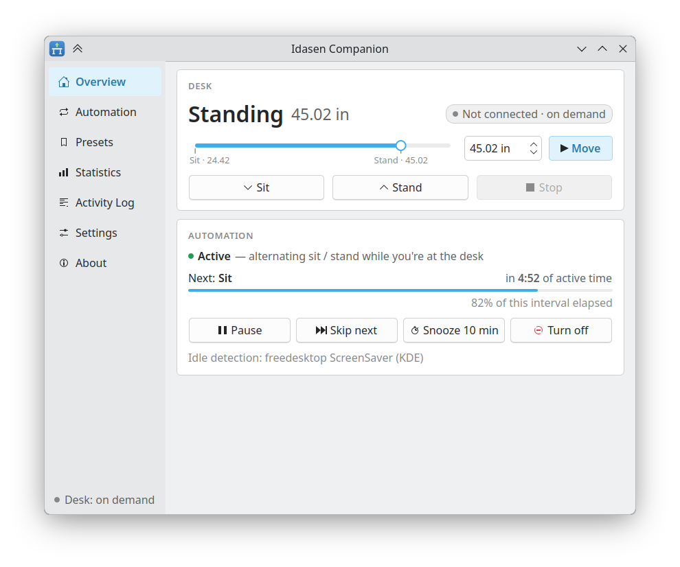
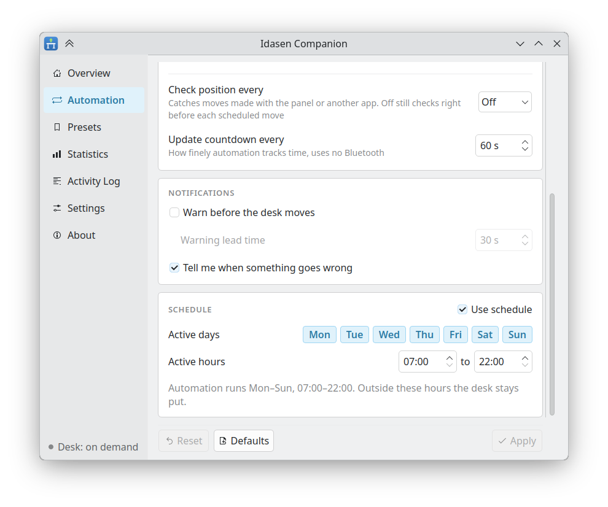
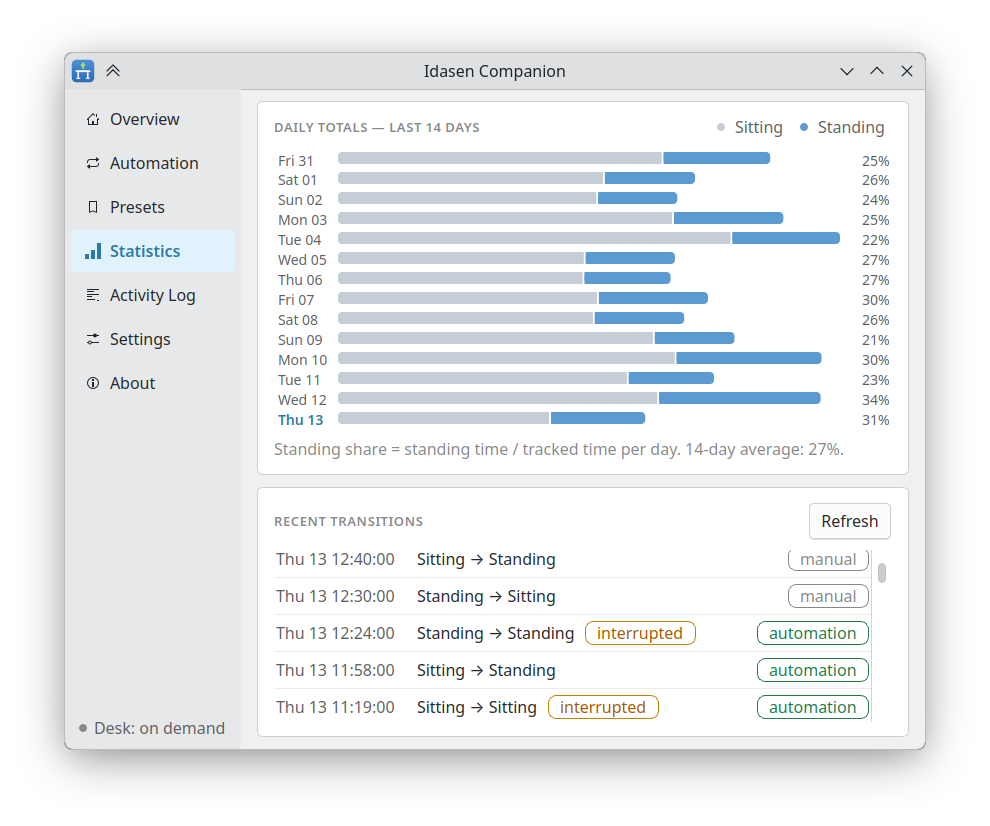
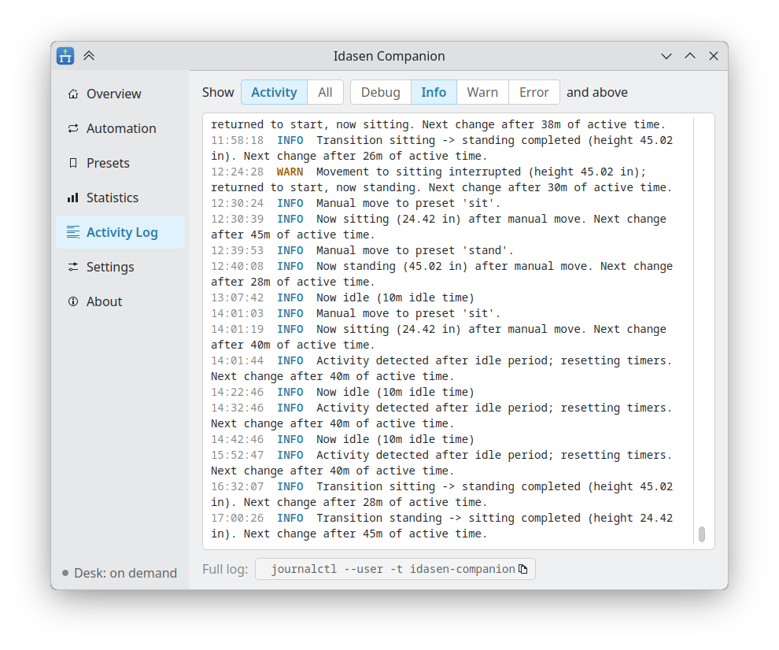
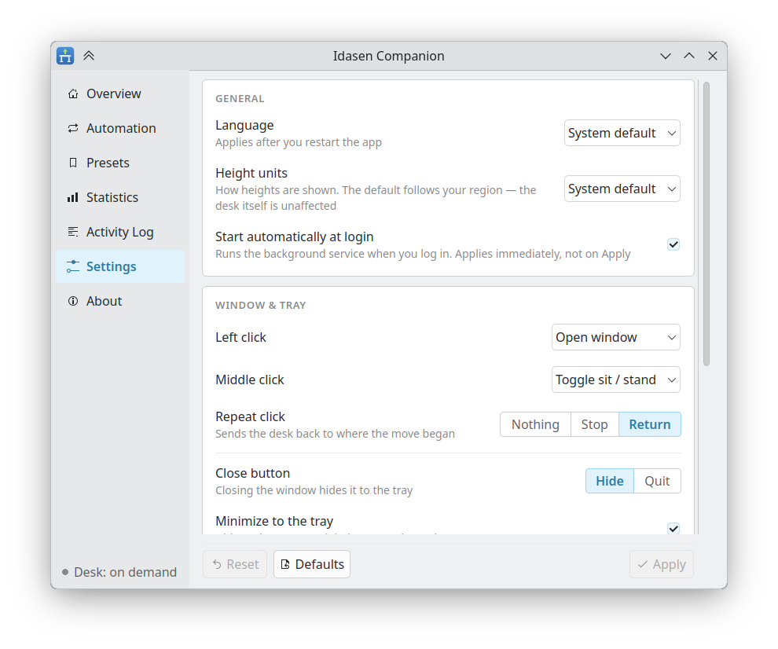

# Idasen Companion

A Linux desktop app that automatically alternates an IKEA Idåsen desk between
sitting and standing.

<p align="center">
  <a href="data/screenshots/1-overview.png" target="_blank"></a>
  <a href="data/screenshots/2-automation.png" target="_blank"></a>
  <a href="data/screenshots/3-statistics.png" target="_blank"></a>
  <a href="data/screenshots/4-logs.png" target="_blank"></a>
  <a href="data/screenshots/5-settings.png" target="_blank"></a>
</p>

<p align="center"><sub>Overview · Automation · Statistics · Activity log · Settings — click to enlarge</sub></p>

Idasen Companion bases each cycle on the time you are actually active at the
computer. Time spent idle or at the lock screen does not count.

A background service manages the Bluetooth connection and automation. The Qt
6 desktop app provides a tray icon, live status, manual controls, presets,
schedules, statistics, an activity log and desktop notifications.

> This is an independent, unofficial project. It is not affiliated with,
> endorsed by, or sponsored by Inter IKEA Systems B.V. IKEA and Idåsen are
> trademarks of their respective owners.

## Features

- **Active-time automation.** Two idle limits control the cycle. A lenient
  limit decides what counts as active time. A strict limit stops a move when
  you are not at the keyboard. A locked session counts as idle. The daemon
  detects suspend and resume, and never moves the desk as the machine wakes.
- **Cycle variation.** The app adds a random number of whole minutes to each
  period, so the moves do not feel mechanical.
- **Interruption handling.** After each move the daemon compares the height
  against the target. If you grabbed the paddle during the move, the desk
  returns to where it started.
- **On-demand Bluetooth.** The daemon connects only when it has work, and
  releases the desk afterwards. Other programs can then reach it. A persistent
  mode is available in the settings.
- **Manual control.** Buttons for sit, stand and stop, a height slider, and
  named presets. On the first start the app imports your saved positions from
  the `idasen` CLI.
- **Schedules.** Set the days and the hours when the automation is active.
- **Notifications.** A warning before each move, with Snooze and Skip.
- **Statistics.** Sit and stand time for each day, with a transition history.
- **English and Spanish.** The desktop app, daemon notifications, activity log
  and command-line output all follow the selected language.

## Requirements

You need Linux with systemd, a session D-Bus and BlueZ. The app supports GNOME
and KDE Plasma on both X11 and Wayland.

> [!CAUTION]
> On wlroots compositors such as sway, Hyprland and river, the app cannot read
> idle time. It will move the desk on schedule even when you are away. The
> Overview page reports the idle backend as `none` in this case.

## Install

Download the package for your system from the [latest release][releases]. To
update, download the newer package and install it over the existing version.

The RPM and Debian packages come in two flavors:

- `idasen-companion` includes the desktop app, CLI and daemon.
- `idasen-companion-headless` includes only the Qt-free CLI and daemon.

The two flavors cannot be installed together.

**RPM, on x86_64 (full)**

```
sudo dnf install ./idasen-companion-[0-9]*.x86_64.rpm
```

The RPM is self-contained: it carries its own Python interpreter and
application libraries, including Qt in the full package. It only relies on the
host for Bluetooth and the desktop libraries used by Qt.

For a smaller installation without the desktop app or Qt, use the headless
package:

```
sudo dnf install ./idasen-companion-headless-*.x86_64.rpm
```

**Debian 13 (trixie) or newer, and Ubuntu 25.10 (questing) or newer (full)**

```
sudo apt install ./idasen-companion_*_all.deb
```

Use `apt` rather than `dpkg -i` so dependencies are installed automatically.
The Debian package uses libraries supplied by the operating system. Older
releases do not provide the required PySide6 packages; use the Flatpak there.

The headless Debian package does not depend on PySide6 or Qt:

```
sudo apt install ./idasen-companion-headless_*_all.deb
```

**Any distribution, with Flatpak**

```
flatpak install --user ./idasen-companion-*.flatpak
```

The Flatpak is a full desktop installation; there is no headless Flatpak. The
app itself is not yet published on Flathub, but the Flathub remote supplies
its KDE runtime. The CLI is available inside the sandbox rather than as a
host command:

```
flatpak run --command=idasen-companion-cli io.github.extricator.IdasenCompanion status
```

### Verify a download

Each release carries a `SHA256SUMS` asset. Download it into the same
directory as the artifact, then run:

```
sha256sum --ignore-missing -c SHA256SUMS
```

The `--ignore-missing` flag prevents files you did not download from being
reported as failures.

This check catches a corrupted or substituted download. It is not a signature,
and it does not prove who built the file.

## First run

Installing a package does not start the daemon. Launch the desktop app to set
up your account:

```
idasen-companion
```

The setup wizard opens on first launch and lists nearby desks. If yours does
not appear, put it in pairing mode by holding the button on the control box
until its light flashes, then scan again.

Before saving anything, the wizard connects to the desk and reads its current
height. With a native package, it then enables the systemd user service so the
daemon starts at each graphical login. The Flatpak uses the desktop Background
portal instead and may show a permission prompt.

The headless package has no setup wizard. Configure the desk first with the
desktop app or the `idasen` CLI, then enable the user service and use
`idasen-companion-cli` for status and control.

To change this later, use **Settings → General → Start automatically at
login**. For a native installation, the equivalent terminal commands are:

```
systemctl --user enable --now idasen-companion.service
systemctl --user disable idasen-companion.service
```

If you already use the `idasen` CLI, the daemon can import the desk address and
saved positions from `~/.config/idasen/idasen.yaml`, so the wizard is optional.

GNOME does not provide tray-icon support by default. Install the
[AppIndicator extension][appindicator] to add it. The app still works without
the extension and opens its main window instead.

## Usage

The main window shows the desk height, cycle progress and movement controls.
The tray menu offers the same actions. Use **Settings → Window & tray** to
choose what left- and middle-clicking the icon do.

The command-line client reports status and recent activity and can control the
desk through the daemon:

```
idasen-companion-cli status
idasen-companion-cli toggle       # move to the other position
idasen-companion-cli sit
idasen-companion-cli stand
idasen-companion-cli preset NAME
idasen-companion-cli stop
idasen-companion-cli log --limit 20
```

`status` uses the configured language, units and clock format. `log` translates
recognized activity messages and falls back to the daemon's English text for
entries written by a newer version. Successful output goes to stdout;
configuration warnings and actionable errors go to stderr. Commands exit 0 on
success, 1 for D-Bus or configuration failures, and 2 for invalid syntax.

Bind the move commands to keys in your desktop's own keyboard settings. The
`idasen-companion` executable is GUI-only; scripts and shortcuts use
`idasen-companion-cli`.

Desktop shortcuts do not fire while the session is locked because the screen
locker has an exclusive input grab. Automation continues in the background.

## Configuration

The configuration file is `~/.config/idasen-companion/config.toml`. Every
duration accepts a value like `45m`, `1h30m` or `90s`. The Settings tab
offers the same options, each with an explanation.

Language, measurement units and hour cycle are independent. `[ui] language`
selects translated text, number symbols and date/time language. Explicit
`units = "cm"` / `"in"` and `clock_format = "12"` / `"24"` values always win;
`"system"` follows the operating system's measurement and time locales, not
the selected app language.

A config written by a newer Idasen Companion may contain sections or options
this version does not know. They produce a visible warning but do not prevent
the GUI or daemon from starting, and they remain in the file through later
Settings edits. A recognized option with a wrong type or invalid value is
still an error. There is intentionally no config schema-version key: additive
options stay downgrade-compatible, and an actual one-way migration will add
versioning only when it is needed.

The daemon writes its log to journald:

```
journalctl --user -t idasen-companion -f
```

## D-Bus API

The daemon exports `io.github.extricator.IdasenCompanion` on the session bus,
at the object path `/io/github/extricator/IdasenCompanion`. The interfaces are
`Desk1`, `Automation1`, `Presets1`, `Stats1` and `Log1`.

```
busctl --user call io.github.extricator.IdasenCompanion \
    /io/github/extricator/IdasenCompanion \
    io.github.extricator.IdasenCompanion.Desk1 Stand
```

Tabular results cross the bus as JSON strings, and live updates as flat typed
signals. This is deliberate: PySide6 cannot demarshal non-variant containers.

## Development

```
python3 -m venv .venv
.venv/bin/pip install -e . pytest pytest-asyncio PySide6-Essentials
.venv/bin/python -m pytest
```

The `--mock-desk` flag runs the daemon against a simulated desk, so the whole
app works without hardware:

```
.venv/bin/idasen-companiond --mock-desk --config /tmp/ic-test.toml
IDASEN_COMPANION_CONFIG=/tmp/ic-test.toml .venv/bin/idasen-companion
```

[`docs/MANUAL-TESTING.md`](docs/MANUAL-TESTING.md) covers the behavior that
needs real hardware.

Bug reports and patches are welcome. Read
[`CONTRIBUTING.md`](CONTRIBUTING.md) before opening a pull request; it covers
the checks to run, translation workflow, package builds and release process.

## License

Copyright © 2026 extricator

Idasen Companion is free software under the GNU General Public License,
version 3 or later. The full text is in [`LICENSE`](LICENSE).

The desktop app uses Qt 6 through [PySide6][pyside6]. The daemon and CLI do not
import or link Qt, which is why the headless packages can remain Qt-free.

The self-contained RPMs bundle their Python interpreter and application
dependencies; the full RPM also bundles PySide6 and Qt. Their package metadata
declares the combined license expression, and the license text for every
bundled component is installed under `/usr/share/licenses/<package-name>/`.

[releases]: https://github.com/extricator/idasen-companion/releases
[appindicator]: https://extensions.gnome.org/extension/615/appindicator-support/
[pyside6]: https://doc.qt.io/qtforpython/
